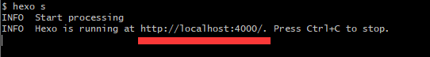
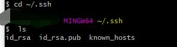
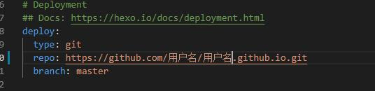

#### 运行环境：
    官网下载下列应用程序：nodeJs,git
    安装完成后打开命令提示符(win+R,输入cmd，回车)
    依次输入： 
        node -v
        npm -v
        git version
    查看是否安装成功(这一步不能少),如未成功,自行设置环境变量

    

<!-- more -->
#### Github项目
登录Github新建项目，项目名必须为：<code>账户名.github.io</code>
勾上 Initialize this repository with a README

#### 安装hexo
在你创建的博客项目文件夹下右键选择git:<code>GitBashHere</code>
在弹出面板中输入： <code>npm install hexo -g</code>
完成后输入： <code>hexo -v== 检查是否安装成功</code>
执行初始化：  <code>hexo init</code>
生成博客页面： <code>hexo g</code>
开启本地服务：<code>hexo s</code>
打开浏览器输入图中画线部分地址即可查看
关闭本地服务,按快捷键： <code>Ctrl+C</code>

#### 关联到Github项目
在项目的git中依次输入：
<code>git config --global user.name "XXXX(你的用户名)"</code>
<code>git config --global user.email "XXXX@xx.xxx(你的注册邮箱)"</code>
检测是否有.ssh文件夹
生成.ssh文件，输入：<code>ssh-keygen -t rsa-C "邮箱"</code> 连续三个回车,检查路径 C:\User\Administrator(备注:用户文件夹)下的.ssh文件。
回到命令框输入:
<code>eval "$(ssh-agent -s)"</code>
<code>ssh-add ~/.ssh/id_rsa</code>
最后登录Github,在个人设置的SSH和GPG密匙一项新建ssh,将你本地的.ssh文件的内容复制到

#### 配置Hexo
在博客项目目录下找到 <code>_config.yml</code>
在文件最下方找到 #Deployment,如下图

#### 新建博文
在博客项目目录下打开git,输入<code>hexo new post "Hello World"</code>
在项目目录/source/_posts目录下可以看到新生成的文件

#### 部署项目
先安装一个扩展，在git中输入：<code>npm install hexo-deployer-git --save</code>
现在可以开始部署了 输入：
<code> hexo clean</code>(清除缓存，可选)
<code> hexo g</code> (生成博客)
<code>hexo d</code> (部署到github)
浏览器输入： http://用户名.github.io,即可查看

  